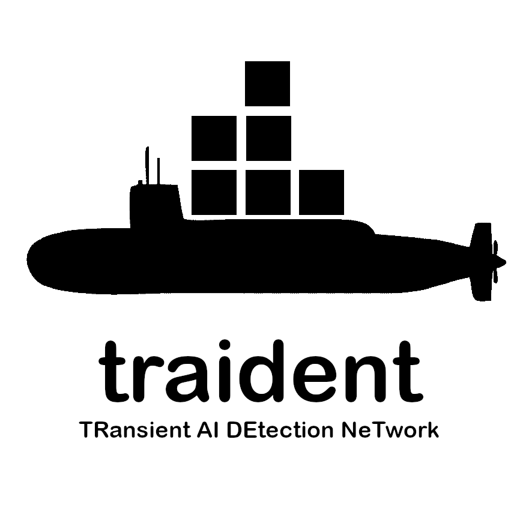

<br>

<br>

Using self supervised machine learning to map timeseries data from the MeerKAT telescope. Mappings (or embeddings) are used in conjunction with anomaly scoring methods to identify interesting time series behaviours.

## Dependencies

This project requires the following major dependencies:

- **PyTorch**: An open source machine learning library used for applications such as computer vision and natural language processing, primarily developed by Facebook's AI Research lab.
- **UMAP**: Uniform Manifold Approximation and Projection for Dimension Reduction is a technique used for dimensionality reduction. It is particularly effective for visualizing high-dimensional data.

For a complete list of dependencies, please refer to the `requirements.txt` file. To install these dependencies, run the following command:

```bash
pip install -r requirements.txt

